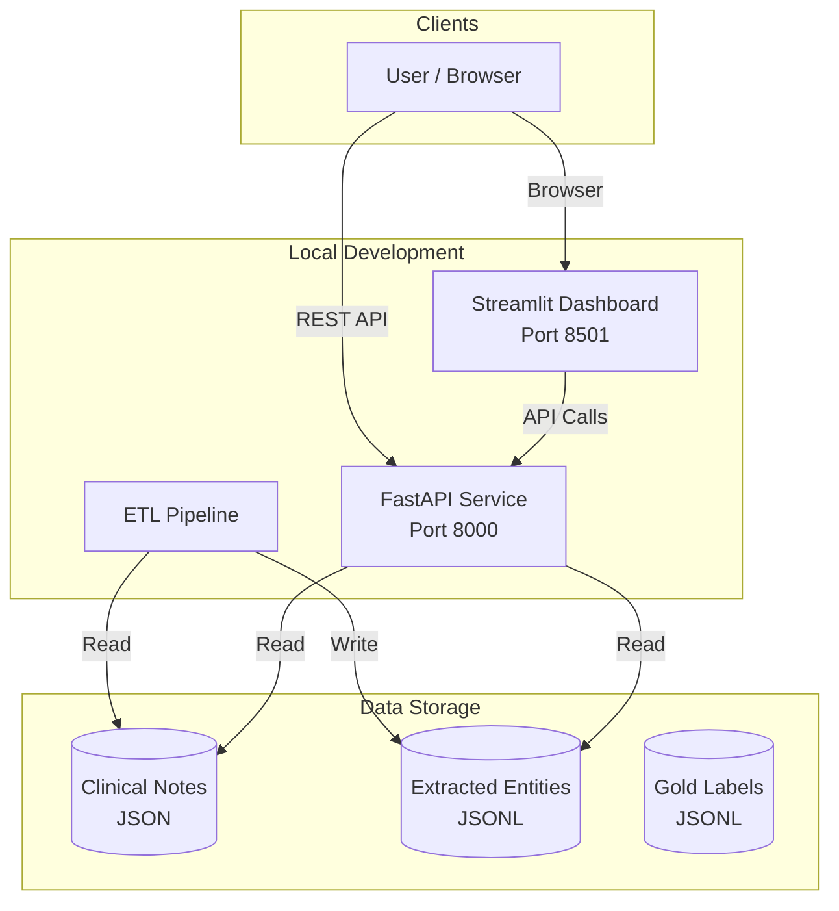

# HC-TAP: Healthcare Text Analytics Pipeline

A production-ready pipeline that extracts medical entities (Problems and Medications) from clinical notes, evaluates extraction accuracy using F1 scores, and surfaces KPIs through an interactive dashboard.

## Overview

### What It Does

HC-TAP automatically processes de-identified clinical notes to:
- **Extract** medical entities: PROBLEM (diseases, symptoms) and MEDICATION (drugs, supplements)
- **Evaluate** extraction quality against gold-standard labels using precision, recall, and F1 metrics
- **Visualize** results through a real-time analytics dashboard

### Who Uses It

| User | Use Case |
|------|----------|
| **Healthcare Data Analysts** | Extract structured data from unstructured clinical notes for research |
| **Clinical Informatics Teams** | Monitor extraction accuracy and performance metrics |
| **ML/NLP Engineers** | Compare extraction methods (rule-based, spaCy, LLM) |
| **Healthcare IT** | Run batch ETL pipelines on clinical note repositories |

### Key Features

- Multiple extraction methods: Rule-based, spaCy NER, and LLM (Claude/GPT)
- Real-time extraction API with rate limiting
- Interactive Streamlit dashboard with KPI metrics
- Comprehensive evaluation framework (exact/relaxed F1 scores)
- Cloud-ready with AWS deployment (ECS Fargate, S3)

## Architecture



### AWS Cloud Architecture

For production deployment, HC-TAP uses:
- **ECS Fargate**: Serverless containers for API, Dashboard, and ETL
- **Application Load Balancers**: Public endpoints for API and Dashboard
- **S3 Buckets**: Raw notes and enriched entities storage
- **ECR**: Docker image registry
- **Secrets Manager**: API keys for LLM extraction

See [`infra/README.md`](infra/README.md) for detailed AWS architecture.

## Quick Start

### Option 1: Docker (Recommended)

```bash
# Clone the repository
git clone https://github.com/withsivram/hc-tap.git
cd hc-tap

# Start all services
make docker-up
```

Access the services:
- **API Documentation**: http://localhost:8000/docs
- **Dashboard**: http://localhost:8501

### Option 2: Local Python Development

**Prerequisites:**
- Python 3.12+
- pip

```bash
# 1. Create virtual environment
python3 -m venv .venv
source .venv/bin/activate

# 2. Install dependencies
make bootstrap

# 3. Copy environment template
cp .env.template .env

# 4. Run ETL pipeline (extract entities from notes)
make etl-local

# 5. Evaluate against gold labels
make eval

# 6. Start the dashboard
make dash
```

## Project Structure

```
hc-tap/
├── services/
│   ├── api/              # FastAPI REST service
│   │   ├── app.py        # Main API application
│   │   └── settings.py   # Configuration
│   ├── analytics/        # Streamlit dashboard
│   │   └── dashboard.py  # KPI dashboard
│   ├── etl/              # ETL pipeline
│   │   ├── etl_local.py  # Local extraction runner
│   │   ├── etl_cloud.py  # Cloud extraction runner
│   │   └── rule_extract.py # Rule-based extractor
│   ├── eval/             # Evaluation framework
│   │   └── evaluate_entities.py  # F1 score calculation
│   └── extractors/       # Entity extractors
│       ├── spacy_extract.py      # spaCy NER
│       └── llm_extract.py        # LLM-based extraction
├── fixtures/
│   ├── notes/            # Input clinical notes (JSON)
│   └── enriched/         # Extracted entities (JSONL)
├── gold/                 # Gold-standard labels for evaluation
├── infra/                # AWS CDK infrastructure
├── scripts/              # Utility scripts
├── tests/                # pytest test suite
├── docs/                 # Documentation
├── Dockerfile.*          # Container definitions
├── docker-compose.yml    # Local orchestration
├── Makefile              # Development commands
└── requirements.txt      # Python dependencies
```

## API Reference

### Endpoints

| Method | Endpoint | Description |
|--------|----------|-------------|
| `GET` | `/` | Health check |
| `GET` | `/health` | Detailed health status |
| `GET` | `/notes/{note_id}` | Get note with extracted entities |
| `GET` | `/search?type=&q=` | Search entities by type or text |
| `GET` | `/stats/run/{run_id}` | Get run statistics |
| `GET` | `/stats/latest` | Get latest run stats |
| `POST` | `/extract` | Extract entities from text (real-time) |

### Example: Extract Entities

```bash
curl -X POST http://localhost:8000/extract \
  -H "Content-Type: application/json" \
  -d '{"text": "Patient has diabetes and takes metformin 500mg daily."}'
```

Response:
```json
{
  "entities": [
    {"entity_type": "PROBLEM", "text": "diabetes", "norm_text": "diabetes", "begin": 12, "end": 20, "score": 0.95},
    {"entity_type": "MEDICATION", "text": "metformin 500mg", "norm_text": "metformin", "begin": 31, "end": 46, "score": 0.92}
  ]
}
```

## Dashboard

The Streamlit dashboard provides real-time KPIs:

### Metrics Displayed

| Metric | Description |
|--------|-------------|
| **Run ID** | Current extraction run identifier |
| **Total Entities** | Count of extracted PROBLEM + MEDICATION entities |
| **Precision** | % of predictions that are correct |
| **Recall** | % of gold entities found |
| **Strict Exact F1** | F1 with exact span matching |
| **Strict Relaxed F1** | F1 with overlapping span matching |
| **Intersection F1** | F1 on notes present in both gold and predictions |

### Understanding F1 Scores

- **F1 Score** = 2 × (Precision × Recall) / (Precision + Recall)
- **Exact Match**: Predicted span must match gold span exactly
- **Relaxed Match**: Predicted span only needs to overlap with gold span
- **Strict**: Evaluates all notes
- **Intersection**: Evaluates only notes with both gold and predicted labels

## Available Commands

Run `make help` for all commands. Key ones:

| Command | Description |
|---------|-------------|
| `make docker-up` | Start all services via Docker |
| `make docker-down` | Stop all Docker services |
| `make bootstrap` | Install Python dependencies |
| `make etl-local` | Run rule-based entity extraction |
| `make etl-spacy` | Run spaCy-based extraction |
| `make etl-llm` | Run LLM-based extraction |
| `make eval` | Evaluate predictions vs gold labels |
| `make dash` | Start Streamlit dashboard |
| `make test` | Run pytest test suite |
| `make format` | Format code (black + isort) |
| `make lint` | Run linter (ruff) |

## Extraction Methods

HC-TAP supports three extraction methods:

| Method | Command | Pros | Cons |
|--------|---------|------|------|
| **Rule-based** | `make etl-local` | Fast, deterministic | Limited coverage |
| **spaCy** | `make etl-spacy` | Good balance | Requires model download |
| **LLM** | `make etl-llm` | Highest accuracy | Slow, requires API key |

To use LLM extraction, set your API key in `.env`:
```bash
ANTHROPIC_API_KEY=your-key-here
# or
OPENAI_API_KEY=your-key-here
```

## Cloud Deployment

HC-TAP can be deployed to AWS using CDK:

```bash
cd infra
pip install -r requirements.txt
cdk bootstrap  # First time only
cdk deploy
```

Deployment is automated via GitHub Actions on push to `main`.

See [`docs/CLOUD_DEPLOYMENT.md`](docs/CLOUD_DEPLOYMENT.md) for details.

## Development

### Running Tests

```bash
make test
```

### Code Formatting

```bash
make format  # black + isort
make lint    # ruff
```

### Adding New Notes

1. Add JSON files to `fixtures/notes/` following the schema:
   ```json
   {
     "note_id": "note_001",
     "specialty": "Cardiology",
     "text": "Clinical note content...",
     "checksum": "abc123"
   }
   ```

2. Run extraction: `make etl-local`

3. Evaluate: `make eval`

## Entity Definitions

### PROBLEM
Signs, symptoms, diseases, or disorders mentioned in clinical text.
- **Includes**: "diabetes", "chest pain", "hypertension"
- **Excludes**: Family history, diet, exercise

### MEDICATION
Drugs, brand names, generic names, or supplements.
- **Includes**: "metformin", "aspirin 81mg", "vitamin D"
- **Excludes**: Non-medical therapies

See [`docs/LABELING_GUIDE.md`](docs/LABELING_GUIDE.md) for detailed labeling rules.

## Contributing

1. Fork the repository
2. Create a feature branch: `git checkout -b feature/my-feature`
3. Make changes and run tests: `make test`
4. Format code: `make format`
5. Submit a pull request

## License

This project uses de-identified clinical notes for demonstration purposes only. See [`docs/DISCLAIMER.md`](docs/DISCLAIMER.md) for privacy information.
