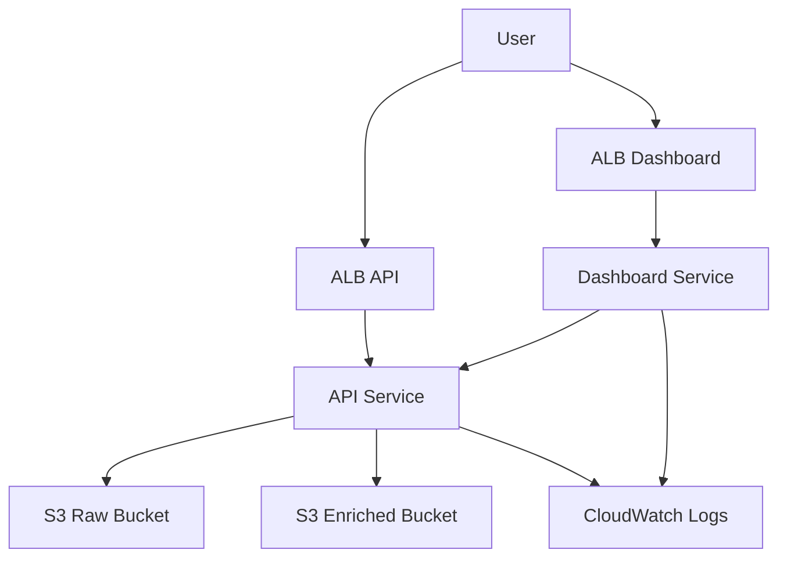

# Infrastructure (AWS CDK)

This directory contains the AWS Cloud Development Kit (CDK) code to deploy the HC-TAP application to AWS.

## Architecture

## Resources

- **VPC:** Default VPC
- **ECS Cluster:** `hc-tap-dev`
- **ECR Repositories:** `hc-tap/api`, `hc-tap/dashboard`, `hc-tap/etl`
- **S3 Buckets:** Raw and Enriched data buckets (KMS encrypted)
- **Fargate Services:** API (Port 8000), Dashboard (Port 8501)
- **ALB:** Two public Application Load Balancers

## Environment Variables

Services are configured with:
- `AWS_REGION`: AWS Region
- `RAW_BUCKET`: S3 bucket for raw notes
- `ENRICHED_BUCKET`: S3 bucket for processed entities
- `API_BASE`: URL of the API Load Balancer (for Dashboard)
- `LOG_LEVEL`: Logging level

## Deployment

Deployment is handled via GitHub Actions:

1.  **Bootstrap:** `cdk bootstrap` (Manual, one-time)
2.  **Docker:** Build and push images (On push to `main`/PR)
3.  **Deploy:** `cdk deploy` (On push to `main`)

To rollback, revert the git commit or manually update the `IMAGE_TAG` env var in the deployment workflow (requires modification).
